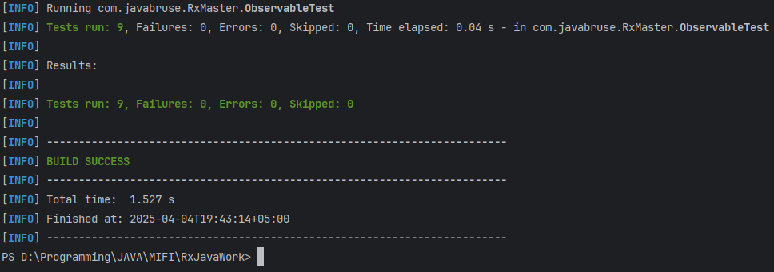

# RxMaster

RxMaster — это простая библиотека реализующая некоторый функционал от исходной RxJava.

## Архитектура

- `Observable<T>` — основной класс, работающий с событиями.
    - `interface OnSubscribe<T>` — интерфейс для подписчика.
    - `final OnSubscribe<T> onSubscribe;` — объект подписчика.
    - `Observable(OnSubscribe<T> onSubscribe)` — конструктор класса.
    - `<T> Observable<T> create(OnSubscribe<T> source)` — статический метод создания объекта `Observable`.
    - `Disposable subscribe(Observer<T> observer)` — метод подписки.
    - `<R> Observable<R> map(Function<T, R> mapper)` — метод преобразует поток данных.
    - `Observable<T> filter(Predicate<T> predicate)` — метод отфильтровывает ненужные элементы.
    - `Observable<T> subscribeOn(Scheduler scheduler)` — метод для подписки в заданном потоке.
    - `Observable<T> observeOn(Scheduler scheduler)` — метод обработки элементов в нужном потоке.
    - `<R> Observable<R> flatMap(Function<T, Observable<R>> mapper)` — метод преобразует элементы в новый `Observable`.
- `Observer<T>` — интерфейс, получатель событий. 
    - `onNext` — получает элементы потока.
    - `onError` — обрабатывает ошибки.
    - `onComplete` — вызывается при завершении потока.
- `Disposable` — интерфейс для отмены подписки.
- `Scheduler` — интерфейс абстракция над потоками.
    - `IOThreadScheduler` — (аналог Schedulers.io(), использующий CachedThreadPool).
    - `ComputationScheduler` — (аналог Schedulers.computation(), использующий FixedThreadPool).
    - `SingleThreadScheduler` — (аналог Schedulers.single(), использующий один поток).

## Особенности и принцип работы Schedulers

В библиотеке реализована поддержка многопоточности через интерфейс `Scheduler`:

```java
public interface Scheduler {
    void execute(Runnable task);
}
```

Schedulers позволяют управлять тем, где и как будет выполняться код Observable — при подписке (`subscribeOn`) и при получении событий (`observeOn`).

### Методы

- `subscribeOn(Scheduler scheduler)` — указывает, в каком потоке будет происходить логика создания Observable (подписка).
- `observeOn(Scheduler scheduler)` — задаёт поток, в котором будут приходить события `onNext`, `onError`, `onComplete`.

### Реализации Scheduler

| Класс                   | Поток/исполнитель                        | Назначение                                      |
|------------------------|------------------------------------------|-------------------------------------------------|
| `ComputationScheduler` | `FixedThreadPool` на количество ядер     | Для вычислений и тяжёлых задач (CPU-bound)      |
| `IOThreadScheduler`    | `CachedThreadPool`                       | Для операций ввода-вывода (например, сеть, диск)|
| `SingleThreadScheduler`| Один поток                                | Для последовательных операций или UI-потока     |


## Тестирование
Сценарии тестирования:
- `testMapOperator` Преобразование значений.
- `testFilterOperator`	Фильтрация чётных чисел.
- `testFlatMapOperator`	Преобразование одного элемента в несколько.
- `testSubscribeOn`	Запуск Observable в другом потоке (subscribeOn)	Поток начинается с "Thread-".
- `testObserveOn`	Получение данных в другом потоке (observeOn)	Обработка идёт в потоке "Thread-*".
- `testDispose`	Проверка отписки (Disposable)	isDisposed == true после dispose().
- `testMapWithError`	Ошибка внутри map	onError вызывается с "NullPointerException".
- `testFilterWithErrorInPredicate`	Ошибка внутри filter	onError вызывается с "IllegalStateException".
- `testFlatMapWithError`	Ошибка внутри flatMap	onError вызывается с "RuntimeException".

Результаты тестирования:
```shell
mvn test
```
- 

## Примеры использования в Main:
```java
private static void filterAndMap(){ //Пример 1: filter + map
  Observable<Integer> observable = Observable.create(emitter -> {
    emitter.onNext(10);
    emitter.onNext(20);
    emitter.onNext(30);
    emitter.onNext(15);
    emitter.onNext(12);
    emitter.onComplete();
  });

  observable
          .filter(x -> x > 16)
          .map(x -> "Значение: " + x)
          .subscribe(new Observer<>() {
            public void onNext(String item) {
              System.out.println(item);
            }

            public void onError(Throwable t) {
              t.printStackTrace();
            }

            public void onComplete() {
              System.out.println("Завершено");
            }
          });
}

private static void flatMap(){ // Пример 2: flatMap для создания вложенных потоков
  Observable<Integer> observable = Observable.create(emitter -> {
    emitter.onNext(1);
    emitter.onNext(2);
    emitter.onNext(3);
    emitter.onComplete();
  });

  observable
          .flatMap(x -> Observable.create(inner -> {
            inner.onNext(x * 10);
            inner.onNext(x * 100);
            inner.onComplete();
          }))
          .subscribe(new Observer<>() {
            public void onNext(Object item) {
              System.out.println("Получено: " + item);
            }

            public void onError(Throwable t) {
              t.printStackTrace();
            }

            public void onComplete() {
              System.out.println("Завершено");
            }
          });
}

private static void subscribeOnAndBack(){ // Пример 3: subscribeOn — выполнение в фоновом потоке
  Scheduler computation = new ComputationScheduler();

  Observable<String> observable = Observable.create(emitter -> {
    System.out.println("Источник работает в потоке: " + Thread.currentThread().getName());
    emitter.onNext("Rx");
    emitter.onNext("Master");
    emitter.onComplete();
  });
  observable
          .subscribeOn(computation)
          .subscribe(new Observer<>() {
            public void onNext(String item) {
              System.out.println("Получено: " + item);
            }

            public void onError(Throwable t) {}

            public void onComplete() {
              System.out.println("Готово");
            }
          });
}
private static void andObserveOn(){ // Пример 4: observeOn — обработка в другом потоке
  Scheduler io = new IOThreadScheduler();

  Observable<String> observable = Observable.create(emitter -> {
    emitter.onNext("Rx");
    emitter.onNext("Java");
    emitter.onComplete();
  });

  observable
          .observeOn(io)
          .subscribe(new Observer<>() {
            public void onNext(String item) {
              System.out.println("Обработка в потоке: " + Thread.currentThread().getName());
              System.out.println("Данные: " + item);
            }

            public void onError(Throwable t) {}

            public void onComplete() {
              System.out.println("Завершено");
            }
          });
}

private static void disposable(){ // Пример 5: Использование Disposable
  Observable<String> observable = Observable.create(emitter -> {
    emitter.onNext("A");
    emitter.onNext("B");
    emitter.onComplete();
  });
  Disposable disposable = observable.subscribe(new Observer<>() {
    public void onNext(String item) {
      System.out.println("Получено: " + item);
    }

    public void onError(Throwable t) {}

    public void onComplete() {
      System.out.println("Завершено");
    }
  });
  disposable.dispose();
  System.out.println("Подписка остановлена: " + disposable.isDisposed());
}
```
